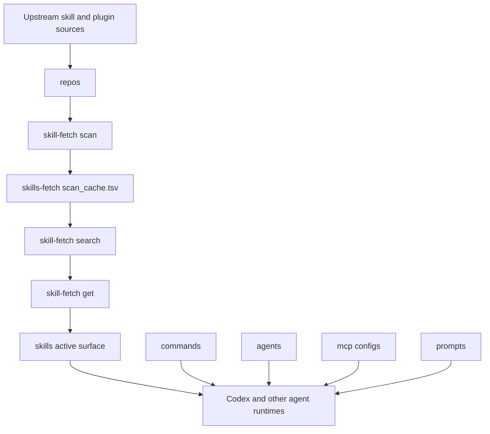

<div align="center">

<p align="center">
  
</p>

<h1 align="center">Agents Workspace</h1>

<p align="center">
  <a href="https://github.com/deathrashed/.agents">
    
  </a>
  <a href="#skill-fetch">
    
  </a>
  <a href="#repository-map">
    
  </a>
  <a href="#maintenance">
    
  </a>
</p>

<strong>A local operations layer for AI agents, skills, commands, MCP configs, prompt packs, and vendored skill sources.</strong>

<br>

[Overview](#overview) | [Quick Start](#quick-start) | [Skill Fetch](#skill-fetch) | [Repository Map](#repository-map) | [Taxonomy Notes](#taxonomy-notes) | [Maintenance](#maintenance)

</div>

---

##  Overview

This repository is the shared local registry behind the AI-agent tooling on this machine. It keeps the active agent surface small while preserving a large source cache of upstream skills, plugins, prompt packs, MCP server configs, and tests.

The current model is intentionally split:

| Layer | Path | Role |
| --- | --- | --- |
| Active skills | [`skills/`](./skills) | Small loaded surface for Codex, Claude, Gemini, OpenCode, and related tools. |
| Source cache | [`repos/`](./repos) | Vendored upstream snapshots used as the canonical source for discoverable skills and plugins. |
| Search index | [`skills-fetch/scan_cache.tsv`](./skills-fetch/scan_cache.tsv) | Tab-delimited index used by `skill-fetch`. |
| Commands | [`commands/`](./commands) | Slash-command style prompt workflows and plugin command packages. |
| Agents | [`agents/`](./agents) | Agent definitions, including loose `.agent.md` files and plugin-shaped agent bundles. |
| MCP configs | [`mcp/`](./mcp) | Local MCP configuration bundles and server support files. |
| Prompt packs | [`prompts/`](./prompts) | Framework and provider prompt templates. |
| Local skills | [`riley/`](./riley) | Personal/local skill packages, mostly Typinator and shell workflows. |
| Tests | [`tests/`](./tests) | Skill-triggering, OpenCode, Claude Code, and subagent workflow tests. |

> [!IMPORTANT]
> Treat this repository as an operational workspace, not a normal application package. Many paths are consumed directly by local tools, symlinks, shell scripts, and external agent runtimes.

##  Quick Start

```bash
git clone https://github.com/deathrashed/.agents.git ~/.agents
cd ~/.agents
skill-fetch status
```

For day-to-day use, keep the active skill surface small and fetch only what the current task needs:

```bash
skill-fetch search "react"
skill-fetch get react-expert
skill-fetch status
```

When you are done with temporary skills:

```bash
skill-fetch clear
```

> [!TIP]
> Use `skill-fetch ui` when `fzf` is available and you want an interactive selector instead of exact-name search.

##  Prerequisites

| Tool | Why It Matters | Notes |
| --- | --- | --- |
| `zsh` | Local shell workflows and helper scripts expect zsh behavior. | This workspace is macOS-first. |
| `git` | Tracks the registry and pulls upstream source snapshots. | Remote is `deathrashed/.agents`. |
| `rg` | Fast search across skills, prompts, and vendored sources. | Preferred over recursive grep. |
| `find` | Used by `skill-fetch` and audit workflows. | BSD `find` on macOS is expected. |
| `awk` | Parses `skills-fetch/scan_cache.tsv`. | More reliable than shell tab parsing. |
| `fzf` | Powers interactive skill selection. | Optional but recommended. |
| `python3` | Runs validation and helper scripts in some skills. | Some validators may also need PyYAML. |

##  Skill Fetch

`skill-fetch` is the main command surface for keeping startup context lean. It searches the source cache, then symlinks selected skills into the active `skills/` directory.

| Command | Purpose |
| --- | --- |
| `skill-fetch scan` | Rebuild the TSV index from the source cache. |
| `skill-fetch search "python"` | Search indexed skills and plugins by name. |
| `skill-fetch search --cat language` | Filter search by category when categories are present. |
| `skill-fetch get react-pro` | Load a skill into the active `skills/` surface. |
| `skill-fetch get org/name` | Prefer a specific source when duplicate names exist. |
| `skill-fetch ui` | Browse and select with `fzf`. |
| `skill-fetch update` | Pull source repos and rebuild the index. |
| `skill-fetch status` | Show active skills, source repos, and indexed items. |
| `skill-fetch clear` | Remove temporary fetched skills from the active surface. |

Current local status observed during this README pass:

```text
Active: 55 skills
Repos: 111
Indexed items: 4929
```

<details>
<summary><strong>Related helper commands</strong></summary>

| Command | Purpose |
| --- | --- |
| `skill-archive` | Batch-categorize flat skills into archive categories. |
| `skill-repo-archive` | Archive skills using their source repo structure. |
| `skill-purge-flat` | Remove flat skills that already exist in source repos. |

</details>

##  Repository Map

```text
~/.agents/
|-- agents/          # Agent definitions and plugin-shaped agent bundles
|-- commands/        # Slash-command prompts and command plugins
|-- mcp/             # MCP configs and local server support files
|-- plugins/         # Plugin templates and local plugin packages
|-- prompts/         # Framework and provider prompt packs
|-- recipes/         # Small YAML automation recipes
|-- repos/           # Vendored upstream source snapshots
|-- riley/           # Personal/local skill packages
|-- skills/          # Active skill surface and local skill folders
|-- skills-fetch/    # Search index plus archive material
|-- tests/           # Triggering and integration tests
|-- _archive/        # Historical imported archives
|-- assets/          # README and workspace visual assets
`-- SESSION_SUMMARY.md
```

<details>
<summary><strong>Large directory profile</strong></summary>

| Path | Approximate Size | Role |
| --- | ---: | --- |
| `repos/` | 2.3G | Vendored source snapshots for skill discovery. |
| `.git/` | 761M | Repository history and object storage. |
| `skills-fetch/` | 258M | Index and archive layer. |
| `_archive/` | 87M | Historical imports and zip/tar sources. |
| `mcp/` | 30M | MCP configs plus local server support files. |
| `platforms/` | 11M | Platform-specific rules and OpenAI skill mirrors. |
| `agents/` | 5.8M | Agent definitions and bundles. |
| `skills/` | 3.5M | Active and local skill surface. |

</details>

##  Architecture



##  Key Workflows

### Add or Refresh Skills

```bash
cd ~/.agents
skill-fetch update
skill-fetch search "testing"
skill-fetch get test-driven-development
```

### Search the Registry

```bash
cd ~/.agents
rg "description:" skills repos prompts commands
rg "SKILL.md" repos
```

### Run Triggering Tests

```bash
cd ~/.agents
tests/skill-triggering/run-all.sh
tests/opencode/run-tests.sh
tests/claude-code/run-skill-tests.sh
```

> [!WARNING]
> Some test and validation scripts depend on local CLIs, Python packages, or configured agent runtimes. Read each test script before treating a failure as a repository regression.

##  Taxonomy Notes

This section is an audit trail for organization work. It documents suggested improvements without moving files automatically.

| Area | Current Role | Status | Recommendation |
| --- | --- | --- | --- |
| `repos/` | Canonical source cache for skill discovery. | High value, very large. | Document update policy and decide whether snapshots should remain tracked or become managed checkouts/submodules. |
| `skills/` | Active runtime surface. | Mixed local folders and symlinks. | Keep intentionally small; document which entries are permanent essentials versus temporary fetched skills. |
| `skills-fetch/` | Search index and archive store. | Operational but broad. | Keep `scan_cache.tsv` obvious; consider separating archive material from index state. |
| `_archive/` | Historical imports and compressed sources. | Useful but stale-looking. | Move long-term imports under a clearer archive boundary if paths are not consumed by tools. |
| `agents/` | Agent definitions. | Duplicate `.agent.md` and `.md` pairs exist. | Diff duplicates and check references before consolidating. |
| `commands/` | Command prompts and command plugins. | Two conventions in one directory. | Document loose commands versus plugin-shaped commands. |
| `mcp/` | MCP configs and support files. | Contains generated dependencies in at least one nested server tree. | Keep generated dependency trees out of tracked source unless required for offline use. |
| `.github/workflows/mdbook.yml` | GitHub Pages workflow. | Likely stale without a root `book.toml`. | Verify before enabling Pages or remove if this repo is not meant to build mdBook docs. |
| macOS metadata | `.DS_Store` and `Icon` files. | Present in working tree. | Ignore or remove when safe; do not let metadata drive behavior. |

> [!CAUTION]
> Do not bulk-delete archive or generated-looking files from this repository without checking consuming scripts. The registry is wired into local tools by path.

##  Documentation Upkeep

When changing directory structure or tool paths, update documentation in the same pass:

| Document | Purpose |
| --- | --- |
| [`README.md`](./README.md) | Human entrypoint and taxonomy map. |
| [`SESSION_SUMMARY.md`](./SESSION_SUMMARY.md) | Historical context for the on-demand skill loading migration. |
| [`prompts/README.md`](./prompts/README.md) | Prompt pack overview. |
| [`tests/claude-code/README.md`](./tests/claude-code/README.md) | Claude Code test harness notes. |
| `*/README.md` under `mcp/` and `plugins/` | Package-specific usage and setup notes. |

Use `rg` to catch stale references after moves:

```bash
rg "skills-fetch|skill-fetch|repos/|_archive|\\.agent\\.md|mdbook" .
```

##  Visual Media

The root README uses one local color CrewAI banner asset:

| Asset | Purpose |
| --- | --- |
| [`assets/crewai-banner.png`](./assets/crewai-banner.png) | Centered top banner image. |

Demo GIFs were skipped for this README pass by request.

##  Maintenance

### Before Editing

```bash
cd ~/.agents
git status --short --branch
skill-fetch status
```

### After Adding Skills

```bash
skill-fetch scan
skill-fetch status
```

### Before Committing

```bash
git status --short
rg "[^ -~]" README.md
```

> [!NOTE]
> The final `rg` command checks this README for non-ASCII characters. This file intentionally keeps visual accents in images, badges, and Iconify-compatible HTML instead of inline Unicode decoration.

##  Troubleshooting

| Symptom | Likely Cause | Check |
| --- | --- | --- |
| A skill does not trigger | It is not in the active `skills/` surface or frontmatter is invalid. | `skill-fetch search name` and inspect `SKILL.md`. |
| A fetched skill is the wrong one | Duplicate names exist across source repos. | Use `skill-fetch get org/name`. |
| Startup is slow | Too many active skills were loaded. | `skill-fetch status` then clear temporary skills. |
| Validation script fails on `yaml` | PyYAML is missing from the interpreter environment. | Install PyYAML for that interpreter or do a direct frontmatter check. |
| GitHub Pages build fails | mdBook workflow may not match this repo. | Check `.github/workflows/mdbook.yml` and root docs config. |

##  Related Local Paths

| Path | Relationship |
| --- | --- |
| `/usr/local/bin/skill-fetch` | Main on-demand loader. |
| `/usr/local/bin/skill-archive` | Archive helper. |
| `/usr/local/bin/skill-repo-archive` | Repo-aware archive helper. |
| `/usr/local/bin/skill-purge-flat` | Flat-skill cleanup helper. |
| `/Volumes/Apfspace/Icons` | Source of the CrewAI banner and other icon assets. |

