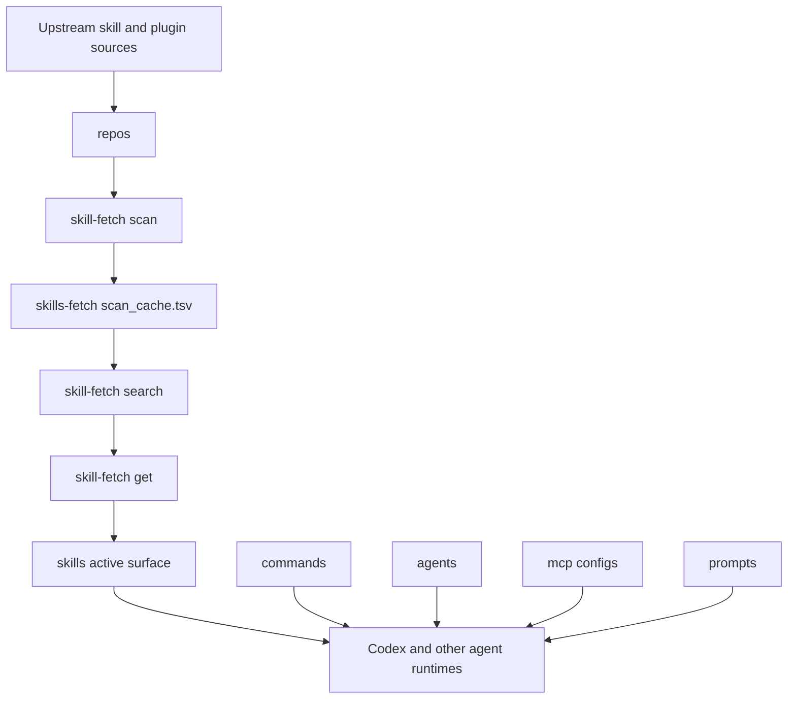

# AI Agent Workspace & Architecture (`~/.agents`)

This repository serves as the centralized workspace for AI agent capabilities, runtimes, staged skill libraries, prompts, plugins, commands, and MCP integrations.

---

## Directory Architecture & Operational Roles

| Directory | Structure / Role | Category Subfolders | Description |
| :--- | :--- | :--- | :--- |
| **`skills/`** | **Runtime Surface (Flat Symlinks)** | *Flat symlink surface* | Active runtime surface directly scanned and read by LLMs/agents. Symlinks point into domain folders inside `skillz/`. |
| **`agents/`** | **Categorized Agent Definitions** | `engineering/`, `design/`, `data/`, `devops/`, `product/`, `security/`, `testing/`, `ai/`, `other/` | Agent definitions organized by specialization domain. |
| **`prompts/`** | **Categorized Prompt Packs** | `frameworks/`, `auth/`, `db-orm/`, `ui-styling/`, `meta/` | Framework and vendor system prompt templates (Angular, Next, Auth0, Clerk, Supabase, Prisma). |
| **`commands/`** | **Categorized Workflows** | `planning/`, `review/`, `code-gen/`, `debugging/`, `infrastructure/`, `docs/`, `other/` | Executable slash commands, CLI tools, and automated workflow scripts. |
| **`plugins/`** | **Categorized Plugin Packs** | `lsp/`, `workflow/`, `code-quality/`, `platform/`, `output-styles/`, `integrations/`, `examples/`, `other/` | Modular plugin extensions organized by purpose. |
| **`mcp/`** | **Categorized MCP Servers** | `cloud-apis/`, `browser/`, `data/`, `dev-tools/`, `other/` | Model Context Protocol server definitions, bridges, and API integrations. |
| **`providers/`** | **Provider Links** | *Top-level symlinks* | Direct navigational links to installed AI provider frameworks. |

---

## Workspace Rules & Best Practices

1. **Categorized Structure:**
   - All major directories (`agents/`, `commands/`, `mcp/`, `plugins/`, `prompts/`) are organized by domain category subfolders.
   - This keeps the root of each directory navigable while grouping related items together.

2. **Clean Subsystems:**
   - Duplicate files and directory names across directories are cleaned up.
   - Each subsystem stores its content directly in its category folders without extra wrapper directories.


---

##  Overview

This repository is the shared local registry behind the AI-agent tooling on this machine. It keeps the active agent surface small while preserving a large source cache of upstream skills, plugins, prompt packs, MCP server configs, and tests.

The current model is intentionally split:

| Layer | Path | Role |
| --- | --- | --- |
| Active skills | [`skills/`](./skills) | Small loaded surface for Codex, Claude, Gemini, OpenCode, and related tools. |
| Agents | [`agents/`](./agents) | Agent definitions organized by domain category (engineering, design, data, devops, etc.). |
| Commands | [`commands/`](./commands) | Slash-command workflows by category (planning, review, code-gen, debugging, infrastructure, docs). |
| MCP configs | [`mcp/`](./mcp) | MCP server definitions by category (cloud-apis, browser, data, dev-tools). |
| Plugins | [`plugins/`](./plugins) | Plugin packs by category (lsp, workflow, code-quality, platform, integrations). |
| Prompt packs | [`prompts/`](./prompts) | Framework and provider prompt templates by domain. |
| Knowledge | [`knowledge/`](./knowledge) | Test plans, design docs, and research artifacts. | |

> [!IMPORTANT]
> Treat this repository as an operational workspace, not a normal application package. Many paths are consumed directly by local tools, symlinks, shell scripts, and external agent runtimes.

##  Quick Start

```bash
git clone https://github.com/deathrashed/.agents.git ~/.agents
cd ~/.agents
skill-fetch status
```

For day-to-day use, keep the active skill surface small and fetch only what the current task needs:

```bash
skill-fetch search "react"
skill-fetch get react-expert
skill-fetch status
```

When you are done with temporary skills:

```bash
skill-fetch clear
```

> [!TIP]
> Use `skill-fetch ui` when `fzf` is available and you want an interactive selector instead of exact-name search.

##  Prerequisites

| Tool | Why It Matters | Notes |
| --- | --- | --- |
| `zsh` | Local shell workflows and helper scripts expect zsh behavior. | This workspace is macOS-first. |
| `git` | Tracks the registry and pulls upstream source snapshots. | Remote is `deathrashed/.agents`. |
| `rg` | Fast search across skills, prompts, and vendored sources. | Preferred over recursive grep. |
| `find` | Used by `skill-fetch` and audit workflows. | BSD `find` on macOS is expected. |
| `awk` | Parses `skills-fetch/scan_cache.tsv`. | More reliable than shell tab parsing. |
| `fzf` | Powers interactive skill selection. | Optional but recommended. |
| `python3` | Runs validation and helper scripts in some skills. | Some validators may also need PyYAML. |

##  Skill Fetch

`skill-fetch` is the main command surface for keeping startup context lean. It searches the source cache, then symlinks selected skills into the active `skills/` directory.

| Command | Purpose |
| --- | --- |
| `skill-fetch scan` | Rebuild the TSV index from the source cache. |
| `skill-fetch search "python"` | Search indexed skills and plugins by name. |
| `skill-fetch search --cat language` | Filter search by category when categories are present. |
| `skill-fetch get react-pro` | Load a skill into the active `skills/` surface. |
| `skill-fetch get org/name` | Prefer a specific source when duplicate names exist. |
| `skill-fetch ui` | Browse and select with `fzf`. |
| `skill-fetch update` | Pull source repos and rebuild the index. |
| `skill-fetch status` | Show active skills, source repos, and indexed items. |
| `skill-fetch clear` | Remove temporary fetched skills from the active surface. |

Current local status observed during this README pass:

```text
Active: 55 skills
Repos: 111
Indexed items: 4929
```

<details>
<summary><strong>Related helper commands</strong></summary>

| Command | Purpose |
| --- | --- |
| `skill-archive` | Batch-categorize flat skills into archive categories. |
| `skill-repo-archive` | Archive skills using their source repo structure. |
| `skill-purge-flat` | Remove flat skills that already exist in source repos. |

</details>

##  Repository Map

```text
~/.agents/
|-- .agents/         # OMA subagent skills (architecture, backend, debug, etc.)
|-- agents/          # Agent definitions by domain category
|-- commands/        # Slash-command workflows by category
|-- apps/            # Application configs and helpers
|-- knowledge/       # Test plans, design docs, research artifacts
|-- mcp/             # MCP server definitions by category
|-- plugins/         # Plugin packs by category
|-- prompts/         # Framework and provider prompt packs by domain
|-- providers/       # Provider framework symlinks
|-- skills/          # Active skill surface (flat)
|-- .agent/          # OpenCode agent configurations
|-- .omo/            # OMO workflow and plan artifacts
|-- README.md        # This file
```

<details>
<summary><strong>Directory profile</strong></summary>

| Path | Approximate Size | Role |
| --- | ---: | --- |
| `repos/` | 2.3G | Vendored source snapshots for skill discovery. |
| `.git/` | 761M | Repository history and object storage. |
| `skills-fetch/` | 258M | Index and archive layer. |
| `_archive/` | 87M | Historical imports and zip/tar sources. |
| `mcp/` | 30M | MCP configs plus local server support files. |
| `platforms/` | 11M | Platform-specific rules and OpenAI skill mirrors. |
| `agents/` | 5.8M | Agent definitions and bundles. |
| `skills/` | 3.5M | Active and local skill surface. |

</details>

##  Architecture


```mermaid
flowchart TD
  A[Upstream skill and plugin sources] --> B[repos]
  B --> C[skill-fetch scan]
  C --> D[skills-fetch scan_cache.tsv]
  D --> E[skill-fetch search]
  E --> F[skill-fetch get]
  F --> G[skills active surface]
  G --> H[Codex and other agent runtimes]
  I[commands] --> H
  J[agents] --> H
  K[mcp configs] --> H
  L[prompts] --> H
```

##  Key Workflows

### Add or Refresh Skills

```bash
cd ~/.agents
skill-fetch update
skill-fetch search "testing"
skill-fetch get test-driven-development
```

### Search the Registry

```bash
cd ~/.agents
rg "description:" skills repos prompts commands
rg "SKILL.md" repos
```

### Run Triggering Tests

```bash
cd ~/.agents
tests/skill-triggering/run-all.sh
tests/opencode/run-tests.sh
tests/claude-code/run-skill-tests.sh
```

> [!WARNING]
> Some test and validation scripts depend on local CLIs, Python packages, or configured agent runtimes. Read each test script before treating a failure as a repository regression.

##  Taxonomy Notes

This section is an audit trail for organization work. It documents suggested improvements without moving files automatically.

| Area | Current Role | Status | Recommendation |
| --- | --- | --- | --- |
| `agents/` | Agent definitions by category. | ✅ Categorized (engineering, design, data, devops, product, security, testing, ai). | Keep organized; add new agents to the appropriate category folder. |
| `commands/` | Slash-command workflows by category. | ✅ Categorized (planning, review, code-gen, debugging, infrastructure, docs). | Keep organized; add new commands to the appropriate category folder. |
| `mcp/` | MCP server definitions by category. | ✅ Categorized (cloud-apis, browser, data, dev-tools). | Keep generated dependency trees out of tracked source (`node_modules/` is gitignored). |
| `plugins/` | Plugin packs by category. | ✅ Categorized (lsp, workflow, code-quality, platform, integrations, examples). | Keep organized; add new plugins to the appropriate category folder. |
| `prompts/` | Prompt packs by domain. | ✅ Categorized (auth, db-orm, frameworks, meta, ui-styling). | Already well-structured; keep as-is. |
| `skills/` | Active runtime surface. | Flat symlinks and local skills. | Keep intentionally small; `.gitignore` handles skill-fetch artifacts and repos/. |
| macOS metadata | `.DS_Store` and `Icon` files. | Handled by `.gitignore`. | `.gitignore` covers standard macOS metadata patterns. |

> [!CAUTION]
> Do not bulk-delete archive or generated-looking files from this repository without checking consuming scripts. The registry is wired into local tools by path.

##  Documentation Upkeep

When changing directory structure or tool paths, update documentation in the same pass:

| Document | Purpose |
| --- | --- |
| [`README.md`](./README.md) | Human entrypoint and taxonomy map. |
| [`agents/README.md`](./agents/README.md) | Categorized agent definitions and persona specs. |
| [`commands/README.md`](./commands/README.md) | Category workflows and slash commands. |
| [`mcp/README.md`](./mcp/README.md) | MCP server definitions and API bridge specs. |
| [`plugins/README.md`](./plugins/README.md) | Plugin extension packs and manifest formats. |
| [`prompts/README.md`](./prompts/README.md) | Framework and provider system prompt templates. |
| [`providers/README.md`](./providers/README.md) | AI provider framework navigation links. |
| [`skills/README.md`](./skills/README.md) | Active runtime skill surface documentation. |
| [`skillz/README.md`](./skillz/README.md) | Source skill library category breakdown. |
| [`.agents/README.md`](./.agents/README.md) | OMA subagent skills & execution protocols. |

Use `rg` to catch stale references after moves:

```bash
rg "skills-fetch|skill-fetch|repos/|_archive|\\.agent\\.md|mdbook" .
```

##  Visual Media

The root README features the workspace architecture header banner:

| Asset | Purpose |
| --- | --- |
| `agents-repo.png` | Centered top header banner image. |

Demo GIFs were skipped for this README pass by request.

##  Maintenance

### Before Editing

```bash
cd ~/.agents
git status --short --branch
skill-fetch status
```

### After Adding Skills

```bash
skill-fetch scan
skill-fetch status
```

### Before Committing

```bash
git status --short
rg "[^ -~]" README.md
```

> [!NOTE]
> The final `rg` command checks this README for non-ASCII characters. This file intentionally keeps visual accents in images, badges, and Iconify-compatible HTML instead of inline Unicode decoration.

##  Troubleshooting

| Symptom | Likely Cause | Check |
| --- | --- | --- |
| A skill does not trigger | It is not in the active `skills/` surface or frontmatter is invalid. | `skill-fetch search name` and inspect `SKILL.md`. |
| A fetched skill is the wrong one | Duplicate names exist across source repos. | Use `skill-fetch get org/name`. |
| Startup is slow | Too many active skills were loaded. | `skill-fetch status` then clear temporary skills. |
| Validation script fails on `yaml` | PyYAML is missing from the interpreter environment. | Install PyYAML for that interpreter or do a direct frontmatter check. |
| GitHub Pages build fails | mdBook workflow may not match this repo. | Check `.github/workflows/mdbook.yml` and root docs config. |

##  Related Local Paths

| Path | Relationship |
| --- | --- |
| `/usr/local/bin/skill-fetch` | Main on-demand loader. |
| `/usr/local/bin/skill-archive` | Archive helper. |
| `/usr/local/bin/skill-repo-archive` | Repo-aware archive helper. |
| `/usr/local/bin/skill-purge-flat` | Flat-skill cleanup helper. |
| `/Volumes/Apfspace/Icons` | Source of the CrewAI banner and other icon assets. |

