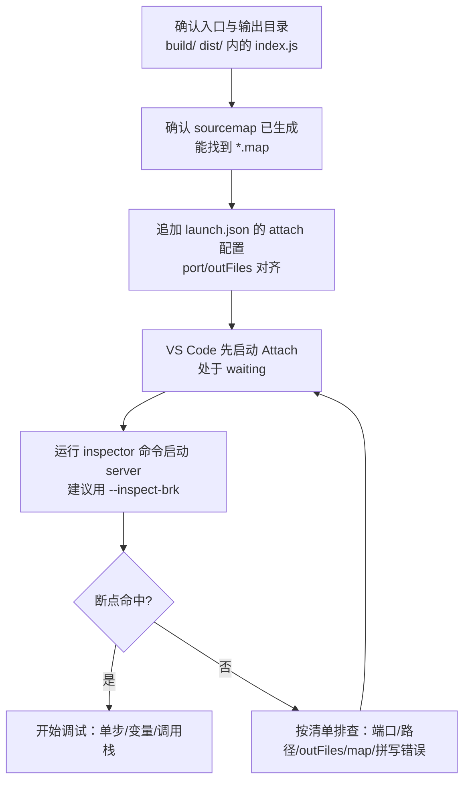

# stdio MCP 断点调试（VS Code Attach + MCP Inspector + Node --inspect）

## 目标

让用户能够在 **VS Code 里稳定命中断点**，调试通过 **stdio** 运行的 MCP Server（通常由 `npx @modelcontextprotocol/inspector ...` 启动），并在遇到端口占用、sourcemap 缺失、断点灰色等问题时有清晰的排查路径。

## Quick Start（最短用法）

你已经有构建产物（例如 `build/internal/index.js` 或 `dist/index.js`），要对 stdio MCP Server 打断点：

- **确保 sourcemap 开启**（构建产物旁边能看到 `.map` 文件）
- 在 MCP 项目根目录的 `.vscode/launch.json` **新增一个 attach 配置**
- VS Code 里先启动这个 **Attach 调试**
- 终端运行（端口要和 launch.json 一致）：

```bash
npx -y @modelcontextprotocol/inspector node --inspect=9229 build/internal/index.js
```

如果你发现“断点不进 / 断点灰色”，先改成：

```bash
npx -y @modelcontextprotocol/inspector node --inspect-brk=9229 build/internal/index.js
```

## 原理（人话版）

- **Node 的 `--inspect`**：会在本机开一个“调试口”（默认就是 9229），VS Code 能连进去控制断点/单步。
- **MCP Inspector**：相当于一个“临时 MCP 客户端 + UI”，它会启动你的 server，并通过 **stdio** 跟它对话。
- **sourcemap**：把“构建后的 JS”映射回“你的 TS 源码”，这样你在 TS 上打断点才会准确。

## 输出格式（请始终按这个模板给用户）

请输出以下 3 块内容（都要可复制粘贴）：

```text
【1) VS Code Attach 配置（launch.json 片段）】
<给出一个完整 configuration 对象，提醒用户追加到 configurations 数组里；明确 port/outFiles 需要匹配>

【2) 启动命令（Inspector + Node --inspect）】
- 默认版：<一条命令>
- 稳定版（首行暂停）：<一条命令>
- 换端口版（如果 9229 占用）：<一条命令>

【3) 排障清单（从最可能到最少见）】
1. ...
2. ...
3. ...
```

## 关键约束（避免“看起来对但就是不行”）

- **端口必须一致**：`launch.json` 的 `port` == `--inspect=PORT` 的 PORT。
- **先 Attach 再启动进程**：第一次建议用 `--inspect-brk`，避免“启动太快错过断点”。
- **调构建产物就必须有 sourcemap**：否则只能在编译后的 JS 里调，TS 断点大概率不准。

## 总流程（一步一步照做）



## 步骤 0：确认入口与输出目录（避免路径写错）

先把“我到底要跑哪个 js 文件”确定下来：

```bash
ls -la build dist 2>/dev/null
```

常见入口：

- `build/internal/index.js`（注意：很多人会写成 `internel`，这是拼写坑）
- `build/index.js`
- `dist/index.js`

## 步骤 1：开启 sourcemap（“直接调构建产物”的前提）

### 1.1 TypeScript（tsconfig）

如果你是 TS 项目，`tsconfig.json` 里至少要有：

```json
{
  "compilerOptions": {
    "sourceMap": true,
    "inlineSources": true
  }
}
```

### 1.2 打包器/构建工具（选你用的那一种）

核心原则就一句话：**构建输出必须带 `.map`**。

- **tsup**：配置 `sourcemap: true`
- **esbuild**：命令或配置加 `sourcemap: true`（或 `--sourcemap`）
- **rollup**：`output.sourcemap: true`
- **webpack**：设置合适的 `devtool`（例如 `source-map`）
- **tsc 直出**：确认 `outDir` 下有 `.js.map`

自检（你应该能看到 `.map`）：

```bash
find build dist -maxdepth 4 -name "*.map" -print 2>/dev/null | head
```

> 如果找不到任何 `.map`，先别急着调断点：把 sourcemap 打开并重新构建一次。

## 步骤 2：在 `.vscode/launch.json` 新增 attach 配置（最关键）

在 MCP 项目根目录新增/修改 `.vscode/launch.json`，把下面这段 **作为一个新配置**加进去（不要覆盖你已有的配置）。

你通常只需要改两处：

- `port`：你准备使用的调试端口（默认 9229）
- `outFiles`：你的输出目录到底是 `build/` 还是 `dist/`

```jsonc
{
  "version": "0.2.0",
  "configurations": [
    {
      "name": "Attach: MCP stdio (Node Inspector)",
      "type": "node",
      "request": "attach",
      "port": 9229,
      "protocol": "inspector",
      "restart": true,
      "timeout": 30000,
      "sourceMaps": true,
      "smartStep": true,
      "skipFiles": ["<node_internals>/**", "**/node_modules/**"],
      "cwd": "${workspaceFolder}",
      "outFiles": [
        "${workspaceFolder}/build/**/*.js",
        "${workspaceFolder}/dist/**/*.js"
      ]
    }
  ]
}
```

## 步骤 3：在 VS Code 里启动 Attach 调试

- 打开 Run and Debug 面板
- 选择 `Attach: MCP stdio (Node Inspector)`
- 点击运行（或按 F5）

此时 VS Code 会进入“等待连接”状态。

## 步骤 4：运行 Inspector 命令启动 server（stdio 模式）

### 4.1 最常用（推荐）

```bash
npx -y @modelcontextprotocol/inspector node --inspect=9229 build/internal/index.js
```

### 4.2 第一次调试更稳（建议先用它）

`--inspect-brk` 会让 Node 在第一行就停住，确保 attach 成功后你再继续执行：

```bash
npx -y @modelcontextprotocol/inspector node --inspect-brk=9229 build/internal/index.js
```

### 4.3 你用 pnpm / yarn

```bash
pnpm dlx @modelcontextprotocol/inspector node --inspect=9229 build/internal/index.js
```

```bash
yarn dlx @modelcontextprotocol/inspector node --inspect=9229 build/internal/index.js
```

## 步骤 5：常见问题（按这个顺序排查）

### 5.1 端口被占用（9229 用不了）

现象：

- 终端提示端口占用
- 或 VS Code attach 失败/连错进程

检查（macOS / Linux 常用）：

```bash
lsof -nP -iTCP:9229 -sTCP:LISTEN
```

处理方式（二选一）：

- **换端口**：比如改成 `9230`
  - 把 `launch.json` 的 `port` 改为 `9230`
  - 把命令也改为 `--inspect=9230`（或 `--inspect-brk=9230`）
- **结束占用端口的进程**：确认是你想结束的进程再 kill

### 5.2 断点灰色 / 不会停（最常见）

优先做这三件事：

- **用 `--inspect-brk` 先稳住**：让进程在第一行停住
- **确认 `.map` 真实存在**：输出目录里必须有 `*.map`
- **确认 `outFiles` 覆盖到了你的输出目录**：例如你实际在 `build/`，就必须包含 `${workspaceFolder}/build/**/*.js`

额外检查点（看到一个就说明 sourcemap 生效了）：

- 构建产物 `.js` 末尾有类似 `//# sourceMappingURL=xxx.js.map`
- VS Code 的 Call Stack 能看到你的源码路径，而不是一堆压缩后的 JS

### 5.3 Inspector 能起，但 server 一闪就退出

可能原因：

- 入口文件路径错了（`build/internel/index.js` vs `build/internal/index.js` 这种拼写最常见）
- server 启动时报错直接退出（去看终端输出）

先做两个最小动作：

```bash
node -p "require('fs').existsSync('build/internal/index.js')"
```

```bash
node --inspect-brk=9229 build/internal/index.js
```

如果第二条能跑起来，说明问题更可能在 inspector 命令或你传参上。

## Examples（示例）

### 示例 1：标准构建产物调试（build 输出）

```bash
npx -y @modelcontextprotocol/inspector node --inspect-brk=9229 build/internal/index.js
```

### 示例 2：端口冲突，换到 9230

1) `launch.json` 把 `port` 改成 `9230`  
2) 命令：

```bash
npx -y @modelcontextprotocol/inspector node --inspect-brk=9230 build/internal/index.js
```

## 兜底策略（你不想/不能调构建产物时）

如果你暂时搞不定 sourcemap（或打包太复杂），可以先用“开发态直接跑源码”的方式调试（前提是你的项目允许这么启动）。

例如使用 `tsx`：

```bash
npx -y tsx --inspect-brk=9229 src/index.ts
```

> 这条不走 inspector；适合先确认“断点/逻辑/流程”本身没问题，再回头补齐构建产物的 sourcemap 调试链路。

