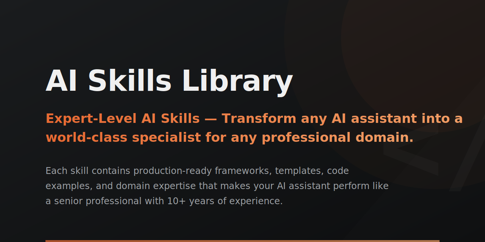

<p align="center">
  
</p>

<h1 align="center">Claude Skills</h1>
<p align="center"><b>The AI skills library for the whole company. Not just engineers.</b></p>

<p align="center">
  
  
  
  
  
  
  <a href="LICENSE"></a>
</p>

---

## Install any skill in one command

```bash
npx @borghei/claude-skills add senior-fullstack
```

Auto-detects Claude Code, Cursor, Codex, Gemini CLI, Copilot, Windsurf, Cline, Aider and Goose. Drops the skill into the right directory for whichever assistant you're using. Node 18+, no Python required for end users.

**Alternative paths:**

- **No setup, any AI chat.** Browse the [skill library](https://borghei.github.io/Claude-Skills), click **Try in Chat** on any skill, paste into Claude.ai, ChatGPT or Gemini.
- **Claude Code native plugin.** Run `/plugin marketplace add borghei/Claude-Skills` in Claude Code.
- **Per-platform manual install.** See [docs/INSTALLATION.md](docs/INSTALLATION.md).

---

## Why teams use this

- **266 skills covering the whole org.** Engineering (76), Marketing (38), C-Level (26), Compliance (21), Legal (17), PM (13), Personal Productivity (10), Product (8), Vertical Advisors (7), Documents (4) and more.
- **18 compliance frameworks built in.** SOC 2, ISO 13485, MDR, FDA, EU AI Act, NIS2, DORA, HIPAA, GDPR and more. The only OSS skills library covering regulated industries.
- **7 vertical strategic advisors.** Fintech, healthtech, edtech, ecommerce, proptech, climate-tech, marketplace — industry-specific frameworks for founders and operators.
- **11 AI assistants supported.** One library, works across Claude Code, Cursor, Codex, Gemini, Copilot, Windsurf, Cline, Aider, Goose, OpenCode and ChatGPT/Claude.ai.
- **674+ Python tools.** Real automation, not prompts. Run `code_quality_analyzer.py`, `dcf_valuation.py`, `seo_audit.py`, `regulatory_trigger_checker.py` directly.
- **67 cs-* agents and 7 personas.** Activate `cs-cto-advisor`, `cs-fintech-advisor`, `startup-cto`, `growth-marketer` or `solo-founder` and get a multi-skill identity in one command.

---

## Browse skills by domain

[Engineering (76)](engineering/) · [Marketing (38)](marketing/) · [C-Level (26)](c-level-advisor/) · [Compliance (21)](ra-qm-team/) · [Business & Growth (16)](business-growth/) · [Legal (17)](legal/) · [PM (13)](project-management/) · [Personal Productivity (10)](personal-productivity/) · [Product (8)](product-team/) · [Vertical Advisors (7)](vertical-advisors/) · [Data (5)](data-analytics/) · [Sales (5)](sales-success/) · [HR (4)](hr-operations/) · [Documents (4)](documents/) · [Finance (3)](finance/) · [All skills →](docs/SKILLS.md)

---

## Key Features

### Cross-Domain Personas

7 personas that combine skills from multiple domains into a single expert identity:

`startup-cto` | `growth-marketer` | `solo-founder` | `content-strategist` | `devops-engineer` | `finance-lead` | `product-manager`

Activate with `/persona startup-cto` or by referencing the persona in conversation.

### Compound Sub-Skill Systems

3 deep-dive skill systems with 21 total sub-skills:

- **Playwright Pro** -- Advanced browser automation, testing patterns, and debugging
- **Self-Improving Agent** -- Agents that evaluate and improve their own performance
- **AgentHub** -- Multi-agent orchestration, tool schemas, and communication protocols

### Slash Commands

26 commands for common workflows:

| Command | Purpose |
|---------|---------|
| `/tdd` | Test-driven development workflow |
| `/rice` | RICE-score feature prioritization |
| `/prd` | Generate a product requirements doc |
| `/retro` | Data-driven sprint retrospective |
| `/tech-debt` | Scan and prioritize technical debt |
| `/security-scan` | Run security audit gate |
| `/a11y-audit` | WCAG accessibility audit |
| `/changelog` | Generate changelog from git history |
| `/sprint-plan` | Plan a sprint from backlog |
| `/focused-fix` | Minimal-blast-radius bugfix |

Run `/README` in Claude Code to see the full list.

### One-Click Skill Setup (No Code Required)

Every skill page on the [website](https://borghei.github.io/Claude-Skills) includes copy-paste prompts for beginners:

| Button | What It Does |
|--------|-------------|
| **Try in Chat** | Instant expertise in any AI chat -- no setup needed |
| **Add to My AI** | Creates a permanent Claude Project or Custom GPT with the full skill. The AI guides you through setup step by step |

No terminal, no git, no configuration. Browse a skill, click copy, paste into your AI, done.

### Orchestration Protocol

4 multi-agent patterns for complex workflows: sequential pipeline, parallel fan-out, supervisor delegation, and consensus voting. Defined in the [Orchestration Protocol standard](standards/).

### MCP Server

Use skills as Claude Code tools via the built-in MCP server:

```bash
python scripts/mcp_server.py
```

### Starter Bundles

Pre-configured skill sets for common roles:

`SaaS Founder Kit` | `DevOps Kit` | `Compliance Kit` | `Growth Kit` | `Product Kit` | `Data Kit` | `Security Kit` | `Finance Kit`

Install with `python scripts/cs.py bundle saas-founder`.

---

## Platform Support

| Platform | Config File | Status |
|----------|-------------|--------|
| **Claude Code** | `CLAUDE.md` | Native |
| **OpenAI Codex** | `AGENTS.md` | Native |
| **Gemini CLI** | `GEMINI.md`, `.gemini/` | Native |
| **Cursor** | `.cursorrules` | Native |
| **GitHub Copilot** | `.github/copilot-instructions.md` | Native |
| **Windsurf** | `.windsurfrules` | Native |
| **Cline** | `.clinerules` | Native |
| **Aider** | `AGENTS.md` | Compatible |
| **Goose** | `.goosehints` | Native |
| **Jules** | `AGENTS.md` | Compatible |
| **RooCode** | `AGENTS.md` | Compatible |

---

## CLI Tool

```bash
python scripts/cs.py <command>

# Commands
  search <query>       Search skills by keyword
  install <skill>      Install a skill into your project
  list                 List all available skills
  stats                Show library statistics
  doctor               Check skill health and integrity
  bundle <name>        Install a starter bundle
```

---

## Documentation

- **Full docs site:** [docs/](docs/) (MkDocs Material)
- **Skills reference:** [docs/SKILLS.md](docs/SKILLS.md)
- **Agents reference:** [docs/AGENTS.md](docs/AGENTS.md)
- **Usage guide:** [docs/USAGE.md](docs/USAGE.md)
- **Installation:** [docs/INSTALLATION.md](docs/INSTALLATION.md)
- **Contributing:** [CONTRIBUTING.md](CONTRIBUTING.md)
- **Standards:** [standards/](standards/)

---

## Contributing

Contributions welcome. See [CONTRIBUTING.md](CONTRIBUTING.md) for guidelines. Fork the repo, create a skill following the [Skill Authoring Standard](standards/), include Python tools and YAML frontmatter, and submit a PR.

---

## Contributors

| Contributor | GitHub |
|-------------|--------|
| Alan Pope | [@popey](https://github.com/popey) |
| Izzy | [@weemax](https://github.com/weemax) |
| Rohan (Tessl) | [@rohan-tessl](https://github.com/rohan-tessl) |

---

## Disclaimer

> **This project is built with the assistance of AI tools (Claude, GPT, etc.).** While every effort is made to ensure accuracy, AI-generated content -- including skill definitions, reference guides, Python tools, frameworks, and documentation -- may contain errors, inaccuracies, or outdated information. Always verify critical information independently before using it in production, compliance, legal, financial, or safety-critical contexts. The authors accept no liability for decisions made based on the content in this repository. Use at your own risk.

---

## License

**MIT + Commons Clause** -- Free for open-source, personal, education, and internal business use. Cannot be sold or repackaged as a paid product. See [LICENSE](LICENSE) for full terms.

---

<p align="center">
  <strong>266 skills. 674+ tools. 17 domains. 74 agents. 11 platforms.</strong><br>
  <a href="https://borghei.me">borghei.me</a>
</p>

<p align="center">
  <a href="https://buymeacoffee.com/borghei"></a>
</p>
