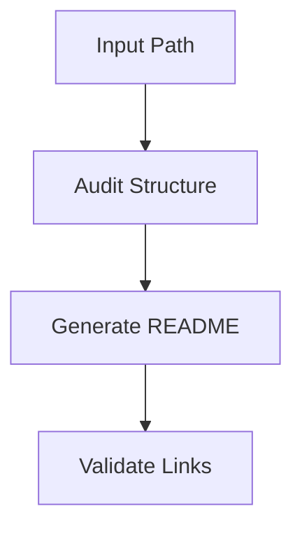

# README Style Contract

Use this reference while generating the final README.

## Iconify Syntax

Use Iconify through API-generated SVG image URLs so the README works in GitHub-flavored Markdown without scripts:

```html

```

Use this form for README headings:

```markdown
##  Quick Start
```

Use this form for table or paragraph accents:

```html

```

Iconify also documents `<iconify-icon icon="mdi:home"></iconify-icon>` for HTML pages with the Iconify web component available. Do not use that component in GitHub READMEs unless the target renderer supports it. GitHub-safe READMEs should use the API SVG URL pattern above.

For centered project headers, always place the confirmed top icon or banner before the title:

```html
<p align="center">
  
</p>

<h1 align="center">Project Name</h1>
```

For local icon assets, prefer HTML images with fixed dimensions:

```html
<p align="center">
  
</p>
```

Only use dark and light variants when the user confirms both should be included:

```html
<picture>
  <source media="(prefers-color-scheme: dark)" srcset="./assets/icon-dark.svg">
  <source media="(prefers-color-scheme: light)" srcset="./assets/icon-light.svg">
  
</picture>
```

Do not use emoji, raw Unicode symbols, decorative glyph dividers, or symbol bullets. For visual bullets, use small Iconify image tags inside table cells or paragraphs.

## Badge Pattern

Use shields.io badges with relevant logos and clickable links:

```markdown
[](https://www.zsh.org/)
[](#usage)
```

Choose badge color, logo, and destination based on discovered project context. Use Simple Icons slugs where available through shields.io `logo=`.

## Recommended README Skeleton

```markdown
<p align="center">
  
</p>

<h1 align="center">PROJECT</h1>

<p align="center">
  BADGES
</p>

## Index

- [Overview](#overview)
- [Prerequisites](#prerequisites)
- [Installation](#installation)
- [Usage](#usage)
- [Configuration](#configuration)
- [Project Structure](#project-structure)
- [Architecture](#architecture)
- [Taxonomy Notes](#taxonomy-notes)
- [Troubleshooting](#troubleshooting)
- [Maintenance](#maintenance)

##  Overview

##  Prerequisites

##  Installation

##  Usage

##  Configuration

##  Project Structure

##  Architecture

##  Taxonomy Notes

##  Troubleshooting

##  Maintenance
```

Adapt the skeleton to the project. Do not include empty sections.

## Taxonomy Table Pattern

```markdown
| Area | Current Role | Status | Recommendation |
| --- | --- | --- | --- |
| `src/` | Runtime source | Active | Keep as source boundary |
| `tmp/` | Generated files | Review | Move to ignored cache or archive |
```

## Command Table Pattern

```markdown
| Command | Purpose | Notes |
| --- | --- | --- |
| `npm run build` | Build production assets | Requires dependencies installed |
| `npm test` | Run test suite | Use before publishing changes |
```

## Mermaid Pattern

Use Mermaid only when it clarifies discovered workflow or architecture:



## GitHub Alert Pattern

```markdown
> [!IMPORTANT]
> Run `command` from the repository root so relative paths resolve correctly.
```

Use alerts sparingly and only for real project risks or setup requirements.

## GIF Workflow

If the target has no demo GIF and the user wants one, provide a separate workflow before final README generation:

```bash
# Record a short screen capture with a native recorder or a tool such as Kap.
# Convert MOV/MP4 to GIF with ffmpeg.
ffmpeg -i demo.mov -vf "fps=12,scale=1280:-1:flags=lanczos" -loop 0 assets/demo.gif
```

If the project has no `assets/` or `media/` folder, suggest creating one, but wait for user approval before editing.
